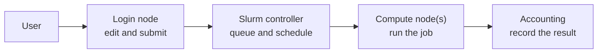

+++
title = "How Slurm and Your Cluster Work"
weight = 10
teaching = 20
exercises = 15
questions = [
  "What happens between submitting a job and receiving its output?",
  "How are nodes, partitions, jobs, allocations, steps, and tasks related?",
  "How can I find my cluster's rules and settings?"
]
objectives = [
  "Explain the path from a login node through Slurm to a compute node.",
  "Distinguish partitions, jobs, allocations, job steps, and tasks.",
  "Inspect available partitions and identify locally defined limits.",
  "Complete a site-settings file and record the local details needed for the first jobs."
]
keypoints = [
  "Slurm assigns resources to jobs, starts and monitors them, and decides which waiting jobs can run next.",
  "A partition groups nodes under shared access rules and limits. Its name and rules depend on the cluster.",
  "A job receives an allocation, and `srun` launches one or more job steps inside it.",
  "Read site documentation and inspect the cluster before choosing partition, account, time, CPU, memory, or storage settings."
]
+++

Complete [Setup]() first so your cluster access,
shared course directory, and starter files are ready. In this episode, you
will use the cluster's documentation and commands to complete `site-settings.sh`
and a short note of local details. The next episode uses these to submit a job.

When you connect to your cluster with SSH, you usually arrive on a **login
node**. It is a place to edit files, compile small programs, inspect results,
and submit work. The compute-heavy part belongs on **compute nodes**, which
Slurm shares among many users.

The [Slurm Quick Start User Guide](https://slurm.schedmd.com/quickstart.html)
describes three main roles for Slurm. In practical terms, it:

1. assigns resources, such as CPUs and memory, to a job for a limited time
1. starts and monitors the job's programs on the assigned nodes
1. decides which waiting jobs can start when several jobs need the same
   resources, using job priorities and the cluster's rules



You normally interact with this system through commands rather than by
connecting directly to compute nodes.

## The Terms You Need

**Node**
: A computer managed by Slurm. A compute node contributes resources such as
  CPUs, memory, and sometimes GPUs.

**Partition**
: A named group of nodes with access rules and limits. A partition often acts
  like a queue: it may accept only certain users, job sizes, or runtime limits.
  Partitions may overlap and their names are chosen by the site.

**Job**
: A request submitted to Slurm together with the work to run. A job moves
  through states such as pending, running, completed, or failed.

**Allocation**
: The resources granted to a job: for example, one node, four CPUs, 2 GiB of
  memory, and 10 minutes. A pending job does not have its allocation yet.

**Job step**
: Work launched inside an allocation, commonly with `srun`. A job may contain
  one step or several steps running one after another or at the same time.

**Task**
: One process launched as part of a step. A program that uses one CPU usually
  needs one task. A program with several cooperating processes, such as an MPI
  program, commonly needs several tasks. Threads inside one process are not
  separate Slurm tasks.


People often use “job” to mean both the submitted request and the allocation
it eventually receives. The distinction matters while the job is pending: the
request exists, but no resources have been granted yet.


## Configure Your Submission Options {#portable-script-local-submission}

Work in the shared course directory you created in Setup and open
`site-settings.sh` in your editor. This is the file you will fill in as you
work through the next three steps:

```bash
SLURM_SITE_ARGS=(
  --partition="replace-with-a-short-partition"
  # --account="replace-with-your-account"
  # --qos="replace-with-an-allowed-qos"
  # --reservation="replace-with-a-course-reservation"
)
```

This Bash array holds the options that later exercises pass to Slurm.
Replace the partition placeholder. The lines starting with `#` are inactive:
remove the `#` and replace the placeholder only when you need to select that
option. Leaving a line commented out lets Slurm use its configured behaviour.

If your instructor has provided a tested settings file for your account and
course session, use it and follow the steps to understand its values.
Otherwise, use your site's user documentation and the commands below to fill
the template. If a command is unavailable or a setting is unclear, consult the
instructor or support team instead of guessing.


Partition names, accounts, QoS values, reservations, storage paths, and
interactive-job rules are set by each cluster. A value copied from PSI, CERN, or
another institution can be invalid or inappropriate on your cluster.


### 1. Choose a Short CPU Partition {#inspect-the-partitions}

Start by inspecting the cluster:

```bash
sinfo
```

This default display groups nodes by partition and state. The same partition
can appear on several lines when its nodes have different states.

To compare partition limits and resources, request these fields:

```bash
sinfo -o "%P %a %l %D %G"
```

The columns mean:

- `%P`: partition name; `*` marks the default partition
- `%a`: whether the partition is available
- `%l`: maximum time limit
- `%D`: number of nodes represented by the line
- `%G`: generic resources, often GPUs, if configured

Look for a partition intended for CPU jobs lasting a few minutes. Do not
choose one only because it currently has idle nodes: check its intended use
in the site documentation.

Example output from one cluster:

```text
PARTITION AVAIL TIMELIMIT NODES GRES
short up 1:00:00 14 (null)
standard* up 12:00:00 14 (null)
long up 7-00:00:00 14 (null)
```

Here `short` is a candidate, and `standard` is the default partition when
none is requested. The `*` is not part of its name. `TIMELIMIT` is the maximum
runtime, not the default runtime of a job. The node counts can overlap because
partitions can share nodes.

Inspect your candidate, replacing `YOUR_PARTITION` with its name:

```bash
scontrol show partition YOUR_PARTITION
```

For `short` on the example cluster, selected fields are:

```text
PartitionName=short
   AllowAccounts=root,test,t3 AllowQos=ALL
   Default=NO QoS=day_short
   DefaultTime=00:45:00 MaxTime=01:00:00
   ReqResv=NO
```

`MaxTime` gives a one-hour partition limit; `DefaultTime` gives 45 minutes if
you omit `--time`. Account or QoS limits may also apply. Note both times for
later exercises; they do not need to go in `site-settings.sh`, because each
job script will request its own runtime.

**Update your file:** replace the partition placeholder with the name chosen
for your cluster. For this example, the line becomes `--partition="short"`.
Next, check account access; the partition's `AllowAccounts` list alone does
not tell you which account you can use.

The [official `sinfo` documentation](https://slurm.schedmd.com/sinfo.html) and
[`scontrol` documentation](https://slurm.schedmd.com/scontrol.html) define the
commands. Your site documentation explains which partitions you may use and
what limits apply.


Suppose `sinfo` prints this fictional cluster:

```text
PARTITION AVAIL TIMELIMIT NODES GRES
short*       up     30:00     8 (null)
standard     up  1-00:00     8 (null)
accelerator  up   2:00:00     2 gpu:a100:4
```

1. Which partition is the default?
1. Which partition advertises GPUs?
1. Is this enough information to decide whether your account may use any of
   these partitions?


1. `short` is the default because its name has `*`.
1. `accelerator` advertises A100 GPUs.
1. No. The output does not establish access rules, account requirements, QoS,
   costs, reservations, or intended use. Read the site documentation and, if
   useful, inspect the partition with `scontrol show partition`.



### 2. Check Your Account and Job QoS

An **account** is the project or group against which Slurm records job usage;
it is not necessarily your login name. A **QoS (Quality of Service)** is a
named set of scheduling rules, such as resource limits or priority. Sites
often supply defaults for both, so these options may remain commented out.

If site documentation or your instructor specifies values, use those.
Otherwise, these read-only commands can help identify your accounts and
allowed job QoS values:

```bash
sacctmgr show user where name="$USER" format=User,DefaultAccount

sacctmgr show assoc where user="$USER" \
  format=Cluster,Account,Partition,QOS%30,DefaultQOS
```

Continuing the same cluster example, with the username replaced by `learner`:

```text
      User   Def Acct
---------- ----------
   learner         t3

   Cluster    Account  Partition                            QOS   Def QOS
---------- ---------- ---------- ------------------------------ ---------
     tier3   gpu_gres                                    normal
     tier3         t3                                    normal
```

- `t3` is this user's default account and is allowed by the partition `short`.
  Slurm normally uses it when `--account` is omitted. The other listed account,
  `gpu_gres`, is for the example site's GPU work.
- `normal` is the only allowed job QoS listed for both accounts. The blank
  `Def QOS` column reports no explicit default; it does not mean "no QoS" or
  prove that `--qos` must be supplied.
- The blank `Partition` column means these account entries are not specific to
  a partition. Each partition's access rules still apply.

**Update your file:** leave `--account` commented out if the default account
is appropriate and your site lets you omit that option. Otherwise,
uncomment it and enter an allowed account. Do the same for `--qos`: use the
site default when documented, or explicitly select an allowed job QoS. In
this example, explicit choices would be `--account="t3"` and `--qos="normal"`.

It is normal for `sacctmgr` to be unavailable or restricted. If you cannot
establish the appropriate values or defaults, ask your instructor or support
team; you do not need to solve the accounting configuration yourself.


The earlier `QoS=day_short` applies limits to the partition automatically; it
does not assign `day_short` as your job QoS. A job using `normal` can also be
subject to the partition's `day_short` limits. `AllowQos=ALL` means the
partition does not restrict QoS names, not that your account may use every
QoS. See Slurm's [QoS documentation](https://slurm.schedmd.com/qos.html).


### 3. Check Whether a Reservation Has Been Assigned

A **reservation** sets aside resources for particular users or accounts
during a specified period, for example for a workshop. The exercises do not
inherently require one. If the instructor or site has assigned a reservation,
they should provide its name and when it is valid.

In the partition example, `ReqResv=NO` means the partition itself does not
require a reservation. A job QoS or workshop instruction could still require
one, so this field alone does not settle the question.

**Update your file:** leave `--reservation` commented out unless your site or
instructor tells you to use a reservation. If one is assigned, uncomment the
line and enter its name.

## Record the Remaining Local Details

Keep a short note, such as `site-notes.md` in your course directory, for the
details that are not submission options. Fill these entries using the steps
above and your site's documentation, and record the documentation links:

| Detail | What to write in your note | Where to find it |
|---|---|---|
| Runtime limits | Maximum and default runtime; in the example, maximum 1 hour and default 45 minutes | `MaxTime` and `DefaultTime` above; site guidance for additional limits |
| Shared course directory | The full path to the directory you created | Run `pwd`; confirm in site documentation that compute nodes can access that filesystem |
| Interactive jobs | The supported command or wrapper, any different submission options, or "not permitted" | Site documentation or instructor; `sinfo` does not establish this policy |
| Python setup | Any module or environment commands needed on login and compute nodes, or "none needed" if confirmed | Site software instructions and the Python version check from Setup |

If a reservation was assigned, also record when it is valid. Node-local
storage is introduced later in [Resource Requests and Efficient Use]();
you can record its path and cleanup rules then. Keep using your shared directory.

## Load and Check Your Settings

For the example cluster, choosing the account and job QoS explicitly and
assuming no reservation has been assigned gives this completed array:

```bash
SLURM_SITE_ARGS=(
  --partition="short"
  --account="t3"
  --qos="normal"
)
```

This demonstrates valid names from the example output, not three universally
required options. If your site's defaults are sufficient, your array may
contain only `--partition`. Use your own confirmed settings.

Save your file, then load it into your current Bash shell:

```bash
source site-settings.sh
printf '%s\n' "${SLURM_SITE_ARGS[@]}"
```

For the explicit example above, the printed options are:

```text
--partition=short
--account=t3
--qos=normal
```

Commented lines will not appear. Printing the array confirms
what you loaded; it does not submit a job or verify that Slurm will accept it.

Later exercises pass this array to Slurm on the submission command line,
keeping cluster-specific options out of the job scripts. Run
`source site-settings.sh` again after editing the file or opening a new shell.

Before moving on, confirm that:

- `site-settings.sh` prints your intended submission options with no active
  placeholders.
- Your site note contains the runtime limits, shared path, interactive-job
  instructions, and Python setup. Any assigned reservation and its valid times
  are recorded.

Continue with [First Batch Job](),
where you will submit a job and check that it runs with these settings.


Provide tested settings before the session. Ask learners to compare the
partition output and account information with their settings file as they
work through the steps. Resolve missing values before the next episode;
learners should finish with a usable file and site note.

