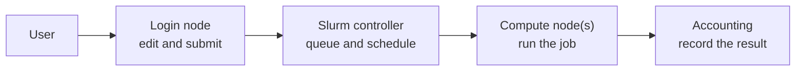

+++
title = "How Slurm and Your Cluster Work"
weight = 10
teaching = 15
exercises = 10
questions = [
  "What happens between submitting a job and receiving its output?",
  "How are nodes, partitions, jobs, allocations, steps, and tasks related?",
  "How can I discover local cluster policy without copying another site's settings?"
]
objectives = [
  "Explain the path from a login node through Slurm to a compute node.",
  "Distinguish partitions, jobs, allocations, job steps, and tasks.",
  "Inspect available partitions and identify locally defined limits.",
  "Record the site-specific settings needed by later exercises."
]
keypoints = [
  "Slurm allocates resources, launches and monitors work, and arbitrates access to a shared cluster.",
  "A partition groups nodes under local limits and policy; it is not a portable job property.",
  "A job receives an allocation, and `srun` launches one or more job steps inside it.",
  "Read site documentation and inspect the cluster before choosing partition, account, time, CPU, memory, or storage settings."
]
+++

As a , you are usually connected to a **login
node**. It is a place to edit files, compile small programs, inspect results,
and submit work. The compute-heavy part belongs on **compute nodes**, which
Slurm shares among many users.

According to the [Slurm Quick Start User Guide](https://slurm.schedmd.com/quickstart.html),
Slurm has three user-facing roles:

1. allocate access to compute resources for a period of time
1. start, execute, and monitor work in that allocation
1. arbitrate contention by keeping pending work in a queue



You normally interact with this system through commands rather than by
connecting directly to compute nodes.

## The Terms You Need

**Node**
: A computer managed by Slurm. A compute node contributes resources such as
  CPUs, memory, and sometimes GPUs.

**Partition**
: A named group of nodes with local limits and policy. A partition often acts
  like a queue: it may accept only certain users, job sizes, or walltimes.
  Partitions may overlap and their names are chosen by the site.

**Job**
: A request submitted to Slurm together with the work to run. A job moves
  through states such as pending, running, completed, or failed.

**Allocation**
: The resources granted to a job: for example, one node, four CPUs, 2 GiB of
  memory, and 10 minutes. A pending job does not have its allocation yet.

**Job step**
: Work launched inside an allocation, commonly with `srun`. A job may contain
  one step, several sequential steps, or several concurrent steps.

**Task**
: One process launched as part of a step. A serial program usually needs one
  task; an MPI program commonly needs many. Threads inside one process are not
  separate Slurm tasks.


People often use “job” to mean both the submitted request and the allocation
it eventually receives. The distinction matters while the job is pending: the
request exists, but no resources have been granted yet.


## Inspect the Partitions

Start with the compact default display:

```bash
sinfo
```

Then request fields useful to a new user:

```bash
sinfo -o "%P %a %l %D %G"
```

The columns mean:

- `%P`: partition name; `*` marks the default partition
- `%a`: whether the partition is available
- `%l`: maximum time limit
- `%D`: number of nodes represented by the line
- `%G`: generic resources, often GPUs, if configured

`sinfo` describes the cluster's current state as well as its configuration, so
the same partition can appear on several lines when its nodes have different
states. Do not choose a partition only because it currently has idle nodes.
Check its purpose and policy in the site documentation.

For more detail about a candidate partition, run:

```bash
scontrol show partition YOUR_PARTITION
```

Useful fields include `Default`, `MaxTime`, `State`, `AllowAccounts`,
`AllowGroups`, and `QoS`. Which fields appear and how they are enforced depends
on the local configuration.

The [official `sinfo` documentation](https://slurm.schedmd.com/sinfo.html) and
[`scontrol` documentation](https://slurm.schedmd.com/scontrol.html) define the
commands. Your site documentation explains what its partition names and policy
mean.

## Inspect Your Own Queue

Even before you submit a course job, learn the command you will use most:

```bash
squeue --me
```

On older Slurm releases where `--me` is unavailable, use:

```bash
squeue -u "$USER"
```

An empty result is fine: it means you currently have no pending or running
jobs. Later, the `ST` column will show a short state and the final column will
show either the allocated nodes or a pending reason.

## Portable Script, Local Submission

In [Setup](), you placed local options in
`site-settings.sh`:

```bash
source site-settings.sh
printf '%s\n' "${SLURM_SITE_ARGS[@]}"
```

Later you will submit portable scripts like this:

```bash
sbatch "${SLURM_SITE_ARGS[@]}" job.sh
```

Partition, account, QoS, and reservation options are supplied at submission
time. The script can therefore be reused on a different cluster after changing
one small settings file.


The [PSI CMS Tier-3 instructions](https://tier3.pages.psi.ch/batch-jobs/SlurmUsage/)
show partitions chosen by maximum runtime and separate accounts for CPU and GPU
resources. The Merlin best-practices material similarly uses duration-tiered
partitions. The portable lesson is the decision process—choose a suitable
short partition after reading local policy—not any one PSI name.



Suppose `sinfo` prints this fictional cluster:

```text
PARTITION AVAIL TIMELIMIT NODES GRES
short*       up     30:00     8 (null)
standard     up  1-00:00     8 (null)
accelerator  up   2:00:00     2 gpu:a100:4
```

1. Which partition is the default?
1. Which partition advertises GPUs?
1. Is this enough information to decide whether your account may use either
   partition?


1. `short` is the default because its name has `*`.
1. `accelerator` advertises A100 GPUs.
1. No. The output does not establish access rules, account requirements, QoS,
   costs, reservations, or intended use. Read the site documentation and, if
   useful, inspect the partition with `scontrol show partition`.




Using your real cluster, record:

- the short CPU partition you will use
- its maximum time
- any required account, QoS, or reservation
- whether interactive allocations are supported
- where course inputs and outputs should be stored

Confirm that `site-settings.sh` contains the required submission options.


Answers are site-specific. They should be supported by current local
documentation rather than inferred solely from `sinfo` or copied from an
example cluster.




Ask learners to compare partition tables in pairs. The names will vary, which
is the point. Resolve site settings before the next episode; otherwise every
submission exercise will stall on avoidable configuration errors.

